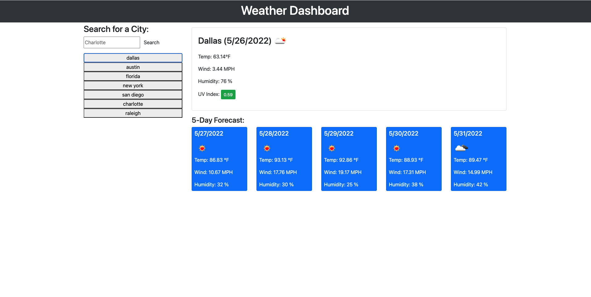

During this challenge I had the opportunity to learn a lot about server-side web api's and learn how to connect different live applications together. This is one of the toughest challenges we've had so far, but with the help of my tutor and professor I was able to overcome certain obsticles that were holding me back from progressing. I was able to build a weather application based on the requirements that we're being asked of and see live updates baesd on weather changes. I really enjoyed this weeks challenge because it feels like everything is slowing coming together while still giving a challenge. Learning more in depth information is really progressing my knowledge and helping me understand things I wasn't understanding the previous week. I definitely struggled a lot with javascript and other components within JS, but I can tell I'm understanding it much better than I was a few weeks ago. 

Deployed Application: https://colinale.github.io/Weather-Dashboard/
Github Repository: https://github.com/colinale/Weather-Dashboard

Images: 
